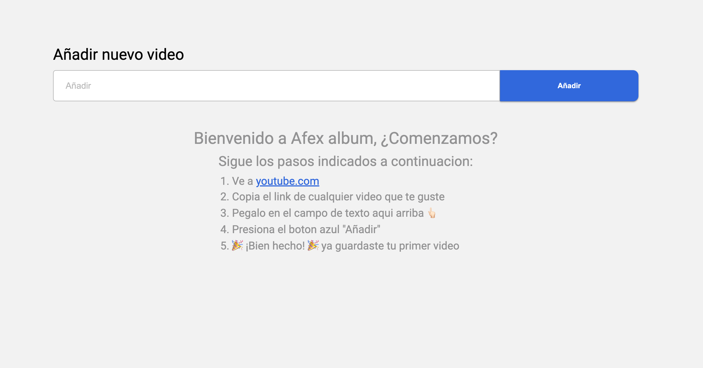
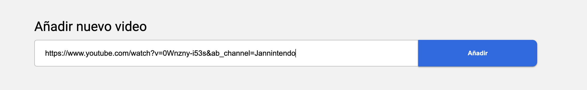
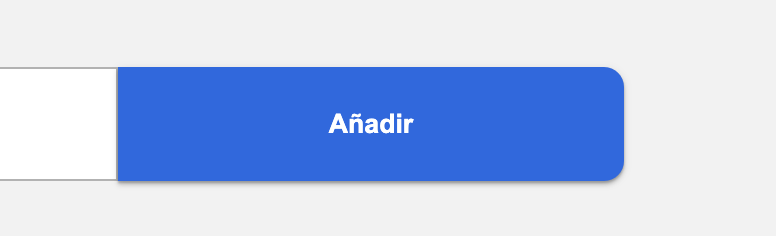
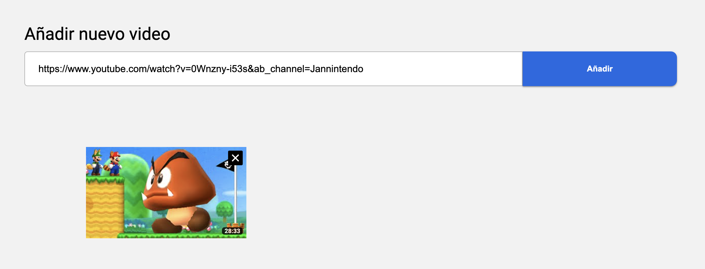
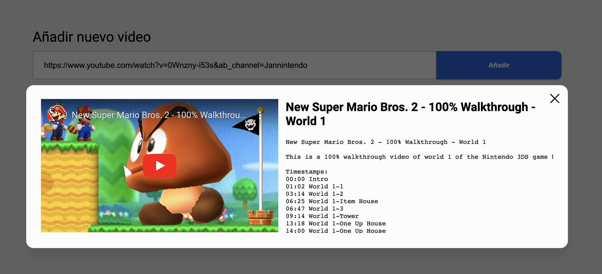
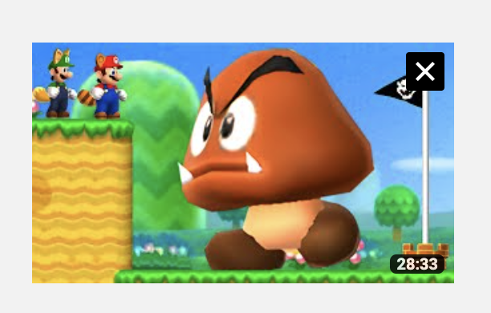

# AFEX ALBUM

## Descripción del Proyecto

AFEX ALBUM es una aplicación web desarrollada como parte de una prueba técnica para el puesto de desarrollador fullstack. Esta aplicación permite a los usuarios ingresar un enlace de YouTube, captura el ID del video y lo almacena en una base de datos DynamoDB a través de un servidor backend. Luego, muestra los videos guardados con miniaturas y brinda la opción de ver los videos en un modal emergente.

## Características Clave

- Captura de enlaces de YouTube y almacenamiento en DynamoDB.
- Visualización de miniaturas de videos guardados.
- Reproducción de videos en un modal emergente.
- Eliminación de videos.

## Tecnologías Utilizadas

- Frontend: React.js + Typescript
- Backend: Node.js, Express.js, Nest.js
- Base de Datos: Amazon DynamoDB

## Instalación

A continuación, se detallan los pasos para instalar y ejecutar el proyecto en un entorno local

1. Clona el repositorio de GitHub: `git clone https://github.com/robertomendoza97/afex-album-front.git`
2. Navega al directorio del proyecto: `cd afex-album-front`
3. Instala las dependencias: `npm install`
4. Renombra el archivo `.env.example` a `.env`
5. Completa la variable con la ruta base de el backend
6. Inicia la aplicación: `npm run dev`

## Uso

1. Abre la aplicación en tu navegador web.
2. Ingresa un enlace de YouTube en el campo de entrada.  
   
3. Haz clic en "Añadir" para guardar el video.  
   
4. Los videos guardados se mostrarán con miniaturas.  
   
5. Para ver un video, haz clic en su miniatura y se abrirá un modal emergente.  
   
6. Para eliminar un video, haz clic en el botón de eliminación (X) que esta en la parte superior derecha.  
   

## Contribución

Si deseas contribuir al proyecto, sigue estos pasos:

1. Haz un fork del repositorio.
2. Crea una rama para tu contribución: `git checkout -b mi-contribucion`
3. Realiza tus cambios y haz commit: `git commit -m "Añade nuevas características"`
4. Sube tus cambios a tu repositorio: `git push origin mi-contribucion`
5. Crea una solicitud de extracción (pull request) en GitHub.

## Licencia

Este proyecto está bajo la Licencia MIT. Consulta el archivo [LICENSE](LICENSE) para obtener más detalles.

## Contacto

Para cualquier consulta o pregunta sobre el proyecto, puedes ponerte en contacto con _Roberto mendoza_ a través de mi correo *robertoemendozac@gmail.com*.
